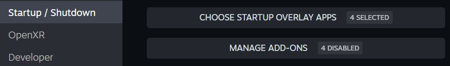
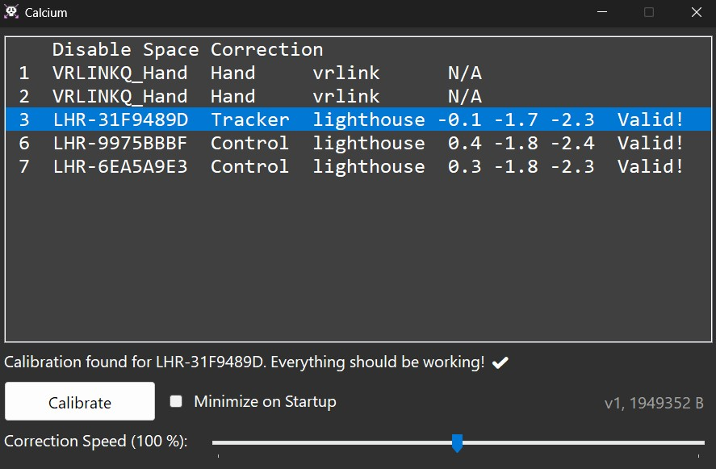

# Calcium VR Calibrator

&nbsp;  

Calcium is a simple way to use Lighthouse devices with inside-out tracked headsets like the Quest series, Steam Frame, etc., without requiring much user input.

Once set up, you can simply launch SteamVR and your devices will be aligned instantly, without requiring re-calibration, and without accumulating drift over a session.

_Calcium requires a tracker mounted rigidly to your headset._ It does not support calibrating with a controller.

&nbsp;  

## Setup Guide

Installation & Updating

---

- Disable or uninstall all other Space Calibrator software. If you choose to disable them, make sure they are off in both "Startup Overlay Apps" and "Add-Ons".

- Download the latest `calcium-installer.exe` from the [Releases Tab](https://github.com/pimaker/calcium/releases).
- Make sure SteamVR is _not_ running.
- Open the installer and click "Install or Update".

For updating, follow the exact same procedure.

To uninstall, run the installer and click "Uninstall". The button will be disabled if Calcium is already gone.

---

First-time Setup & Calibration

---

- First, ensure you have a Lighthouse tracker mounted solidly to your headset. The location and orientation doesn't matter, but it must not move, even during gameplay.
- Next, launch SteamVR like you normally would. Steam Link is officially supported, but any streaming app should work.
- The Calcium control panel will pop up on your desktop. I recommend using the SteamVR overlay (or any other overlay software) to interact with it.
- Turn on the tracker on your headset and wait for it to appear. It's okay to have other trackers active too. If you're having trouble identifying the right device, try moving it (that is, your head) and observing the location display on each line.
- Select your tracker in the list and click `Calibrate`.
- _This is the most important bit!_ Calibrating works similar to other playspace alignment software, but because it's a one-time setup for Calcium, I recommend taking your time. A good quality calibration will last you many play sessions!
    - Move slowly and pause for a second regularly.
    - Rotate your head around all 3 axes (yaw, pitch, roll) gently.
    - Move about in your playspace. Try to do the rotation dance in a few corners far apart to capture scale and translation accurately.
    - Watch the progress counter. If it stalls, you may be moving or rotating too quickly!
    - I find it useful to hold a controller or other tracker in your hand as you go. It will give you an immediate visual indicator of the calibration quality, and what improves it. Note that jitter is expected at this stage, it will smooth itself out after the calibration step!
- Once you hear the Ding, calibration is complete! You can now set the "Minimize on Startup" toggle and forget about the control panel forever*!

\* Note: A calibration will last for as long the offset between your tracker and the headset remains constant. In other words: _As long as the tracker doesn't move, your calibration will remain exact._ This includes moving lighthouses or moving to a different playspace! If you move your tracker, simply repeat the calibration guide.

---

Using Calcium after Setup (<i>the easy part</i>)

---

Just launch SteamVR and make sure the tracker on your headset is turned on and tracking. That's it, really.

There should be practically no drift as long as the target remains tracked. Minor corrections will be applied whenever you are not moving too fast.

You can, in theory, also turn off the tracker on your headset during a play session to conserve battery. Note that drift accumulated by your headset will not be corrected in that case. Turn it back on, even just briefly, to apply a new correction.

---

For Advanced Users

---

Logs and settings are stored at `C:\Users\$USER\AppData\Local\Calcium`. Settings are a loose approximation of the `ini` format because I'm lazy.

The `Correction Speed` slider can be used to adjust how quickly drift is being corrected. Think of it as the sensitivity to discrepancies in HMD and Tracker data. Reduce the value to more slowly align spaces, and require more stillness for change to kick in. Set it higher to align more quickly and at higher velocities, which may introduce overshoot. At higher settings, moving your head may lead to unintended motion on trackers farther away from the pivot, for example on your feet. The default value is generally a good choice.

Calcium will override the pose of devices moved to `0,0,N` with the last known good (or interpolated) pose. That location is how SteamVR/Lighthouse seems to indicate tracking loss. In practice, this means that while Calcium is running, devices snapping to origin after tracking loss will instead stay glued to their last known good position.

Scale alignment is assumed to be 1x by default, if your tracking spaces use different translation scale factors, set `CalibrateScale = true` in the `settings.ini` file.

---

&nbsp;  

Calcium control panel after a successful calibration.

&nbsp;  

## Reporting Issues / Contributing

You may open a [GitHub Issue](https://github.com/pimaker/calcium/issues) if you encounter any bugs. Alternatively, fix them yourself and send over a **Pull Request**!

NOTE: This is not professionally maintained software. I wrote this with the intent of using it myself, and I'm sharing it because I believe others may find it useful. Try to diagnose issues yourself before opening an issue, and don't expect an immediate answer or fix!

You can also join my [Discord Server](https://discord.gg/r38vJd2DuJ) for volunteer support (or just to tell me that it works for you :3).

## Why Another Space Calibrator?

Because I wanted to play with math. ¯\\_(ツ)_/¯

Note that this is _not_ a fork of [OpenVR-SpaceCalibrator](https://github.com/hyblocker/OpenVR-SpaceCalibrator) or any other calibration software. The algorithms and ideas are my own, implemented from scratch. Unavoidably, some parts (like how the hooking works) will be similar, and inspired by my previous contributions to the original SpaceCalibrator - but I deliberately wanted a blank canvas to sketch out my own idea of how space alignment should work.

There exist other alignment software too, which I have not used or looked at. It is possible some use the same or similar implementations to Calcium. Even the official SpaceCalibrator on Steam has recently added relative calibration. I make no claims that Calcium is _better_ than any other software, just that I have not copied them.

I do think the result is good though! I've personally gone from being annoyed at drift, random rotations/offsets, and having to calibrate every time I enter VR, to simply not having to care about space alignment anymore.

It also gives me a blank canvas for other tracking experiments, such as camera-based alignment, in the future :3

## LLM Disclosure

Some AI (LLMs) were used to formulate the math from my head into code, and to generate the native interop bindings. I tried to stick to open-weights models like GLM 5.3 and MiMo-V2.6. The app is not "vibe-coded", as per my own standards at least. I wrote most of it by hand, and took great care to keep the code readable, easy to parse, and as simple as could be.

## License

MIT License. See [LICENSE.md](LICENSE.md).